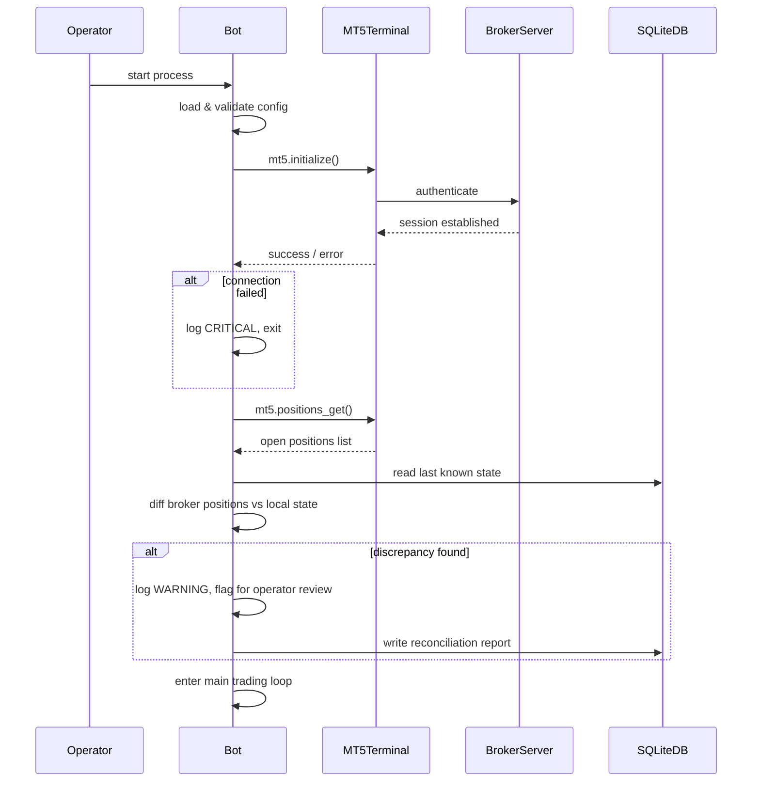
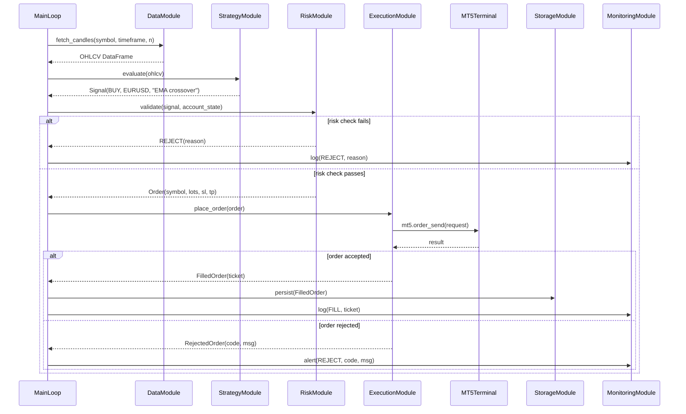
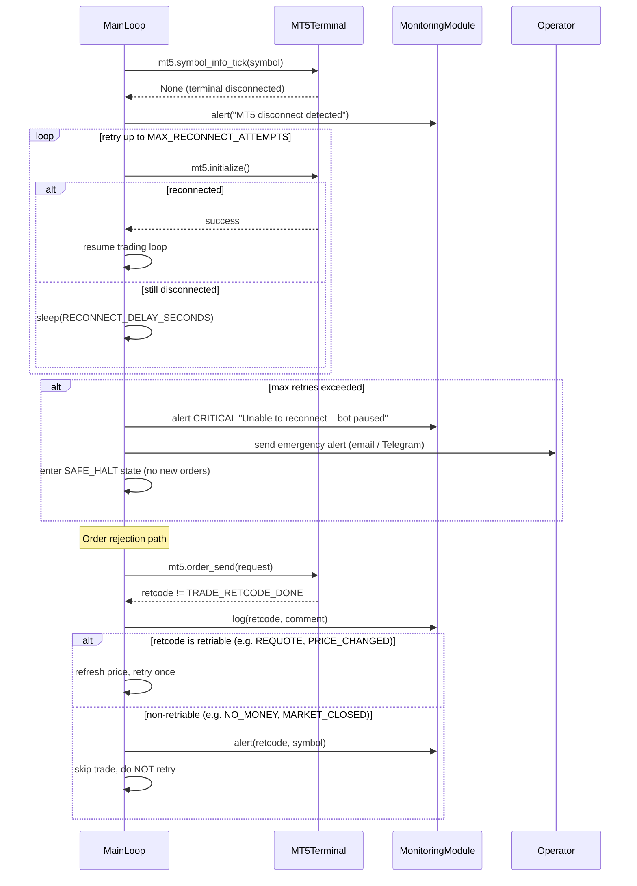

# MT5 Python Architecture

**Date:** 2026-03-26  
**Status:** Approved  
**Audience:** Developer / Bot Operator

---

## 1. Integration Style

Python connects to the MetaTrader 5 (MT5) **terminal via the official `MetaTrader5` Python package** (IPC bridge, not a REST API).

```
┌────────────────────────────────────────────┐
│  Windows / VPS                             │
│  ┌──────────────────────┐                  │
│  │  MT5 Terminal        │  ◄── broker      │
│  │  (must be running)   │      server      │
│  └──────────┬───────────┘                  │
│             │ IPC (shared memory / socket) │
│  ┌──────────▼───────────┐                  │
│  │  Python Bot Process  │                  │
│  └──────────────────────┘                  │
└────────────────────────────────────────────┘
```

### Non-negotiable pre-conditions

| Requirement | Detail |
|---|---|
| MT5 terminal running | Must be logged in to broker account before the bot starts |
| Windows environment | The `MetaTrader5` package only supports Windows (native or VPS) |
| Stable internet | IPC failures = missed trades or stale state |
| Auto-login enabled | Terminal must reconnect automatically after VPS reboot |
| Bot runs as a single process | Prevents duplicate order placement |

> **Note:** MT5 is not the broker. The broker determines account availability, leverage, spreads, and symbol list. See `BROKER_REQUIREMENTS_SA.md`.

---

## 2. System Architecture

### 2.1 Module Map

```
bot/
├── config/         # Load + validate settings (YAML)
├── data/           # Fetch candles, ticks, symbol info from MT5
├── strategy/       # Signal generation (deterministic, rule-based)
├── risk/           # Position sizing, daily loss guard, kill switch
├── execution/      # Order placement, modification, cancellation via MT5
├── storage/        # Persist orders, equity curve, state (SQLite)
├── reconciliation/ # Compare local state vs broker state on startup
└── monitoring/     # Heartbeat, logging, alerts (email / Telegram)
```

### 2.2 Module Responsibilities

| Module | Inputs | Outputs | Key rules |
|---|---|---|---|
| **config** | `config/config.yaml` | validated `Config` object | Fail fast on missing/invalid values |
| **data** | MT5 terminal connection | OHLCV DataFrames, tick data, symbol info | Cache aggressively; never block the main loop |
| **strategy** | OHLCV data, indicators | `Signal(direction, symbol, rationale)` | Must be deterministic; no randomness; no LLM calls |
| **risk** | Signal, account equity, open positions | `Order(symbol, lots, sl, tp)` or `REJECT` | Enforces all hard limits (see §4) |
| **execution** | `Order` | `FilledOrder` or `RejectedOrder` | Idempotent; re-check position before placing |
| **storage** | Orders, equity snapshots | SQLite writes | Append-only; never delete rows |
| **reconciliation** | Local DB + broker positions | Diff report; corrective actions | Run on every startup and every 15 min |
| **monitoring** | All module events | Logs, alerts, heartbeat | Alert on any unhandled exception |

### 2.3 Data Flow (steady state)

```
[MT5 Terminal]
     │ new candle / tick
     ▼
[data module]  ──► candle buffer (in-memory ring buffer)
     │
     ▼
[strategy module]  ──► Signal or NO_SIGNAL
     │ Signal
     ▼
[risk module]  ──► Order or REJECT
     │ Order
     ▼
[execution module]  ──► send to MT5 terminal
     │
     ▼
[storage module]  ──► persist result
     │
     ▼
[monitoring module]  ──► log + optional alert
```

---

## 3. Sequence Diagrams

### 3.1 Startup and Reconciliation



### 3.2 Signal → Order Placement



### 3.3 Failure Handling (Disconnect / Order Rejection)



---

## 4. Non-Negotiable Safety Controls

These controls are hard-coded and cannot be disabled via config without a code change.

| Control | Rule | Implementation |
|---|---|---|
| **Max daily loss** | Bot halts if net P&L for the day ≤ `−MAX_DAILY_LOSS_PCT × account_balance` | Checked before every order; kill switch triggers if breached |
| **Max position size** | Single order lots ≤ `MAX_LOTS_PER_TRADE` | Risk module clamps lot size; never override |
| **Max open trades** | Total open positions ≤ `MAX_OPEN_TRADES` | Checked in risk module before signal is acted on |
| **Spread filter** | Order blocked if current spread > `MAX_SPREAD_POINTS` | Checked via `mt5.symbol_info_tick()` before every order |
| **Trading hours** | Orders only between `TRADE_START_UTC` and `TRADE_END_UTC`; no new trades 30 min before close | Main loop enforces `datetime.utcnow()` check |
| **Kill switch** | Operator creates `KILL_SWITCH` file in bot directory; bot detects it, closes all positions, halts | Polled every loop iteration; also exposed as a signal handler |
| **Circuit breaker** | If `N_CONSECUTIVE_LOSSES ≥ CIRCUIT_BREAKER_THRESHOLD`, bot pauses for `CIRCUIT_BREAKER_PAUSE_MINUTES` | Tracked in storage module; resets at midnight UTC |
| **Stop-loss required** | Every order must include a stop-loss price; orders without SL are rejected by risk module | Enforced in risk module; non-configurable |

> **Example config values (adjust to your account size and risk tolerance):**
> ```yaml
> MAX_DAILY_LOSS_PCT: 0.02        # 2% of account balance
> MAX_LOTS_PER_TRADE: 0.10
> MAX_OPEN_TRADES: 3
> MAX_SPREAD_POINTS: 25
> TRADE_START_UTC: "07:00"
> TRADE_END_UTC: "20:00"
> CIRCUIT_BREAKER_THRESHOLD: 4
> CIRCUIT_BREAKER_PAUSE_MINUTES: 60
> ```

---

## 5. Intraday Higher-Frequency Scope (Retail Context)

### What "higher frequency" means here

This bot is a **retail intraday bot**, not true HFT (high-frequency trading). Realistic expectations:

| Metric | This bot (retail) | True HFT |
|---|---|---|
| Timeframe | 1m – 15m candles | Microseconds / tick-by-tick |
| Trades per day | 5–50 | Thousands |
| Infrastructure | Windows VPS + MT5 terminal | Co-located exchange servers |
| Latency sensitivity | Low–medium (100–500ms is fine) | Sub-millisecond |
| Regulatory requirements | Standard retail | Complex, jurisdiction-specific |

### Latency considerations

| Source | Typical latency | Mitigation |
|---|---|---|
| MT5 IPC (Python ↔ terminal) | 5–50 ms | Keep strategy logic simple; avoid large DataFrames |
| Broker execution (terminal ↔ server) | 50–300 ms | Choose a broker with a server geographically close to your VPS |
| VPS → broker server | 10–100 ms | Use a VPS in a region near the broker's server (ask broker for server location) |
| Python data processing | 1–20 ms | Pre-compute indicators; don't recalculate from scratch on every tick |

### Recommendations for reliable intraday operation

- Use **1-minute or 5-minute candles** as the primary signal timeframe.
- Avoid tick-by-tick processing unless you have a tested, low-latency setup.
- Subscribe to `mt5.copy_rates_from_pos()` on a timer (not event-driven tick callbacks) for simplicity.
- Run the bot on a **Windows VPS** (Contabo, Vultr, or AWS EC2 with Windows) with the MT5 terminal always open.
- Set up **auto-restart** (Task Scheduler on Windows) if the bot crashes.

---

## 6. LLM / Agent Policy

LLMs and agent frameworks (e.g. LangChain, AutoGPT, OpenClaw) are **not permitted** in the execution path.

| Allowed (sidecar only) | Not allowed |
|---|---|
| Summarise daily trade log | Decide trade direction |
| Generate human-readable journal entry | Set stop-loss prices |
| Explain why a rule fired | Place or modify orders |
| Suggest parameter changes (human must approve) | Override risk limits |

---

## 7. Technology Stack

| Component | Choice | Rationale |
|---|---|---|
| Language | Python 3.11+ | Broad library support; MT5 package available |
| Broker bridge | `MetaTrader5` (pip) | Official MT5 Python package |
| Data storage | SQLite via `sqlite3` | Zero-dependency; sufficient for single-bot use |
| Config | `PyYAML` | Human-readable; already used in project |
| Indicators | `pandas-ta` or `ta-lib` | Vectorised; fast |
| Alerts | `smtplib` (email) + optional Telegram Bot API | Low-dependency; reliable |
| Testing | `pytest` + `unittest.mock` | Already used in project |
| VPS OS | Windows Server 2019/2022 | Required by `MetaTrader5` package |

---

*See also: [BROKER_REQUIREMENTS_SA.md](BROKER_REQUIREMENTS_SA.md) · [MVP_ROADMAP_INTRADAY.md](MVP_ROADMAP_INTRADAY.md) · [RISK_POLICY.md](RISK_POLICY.md)*
